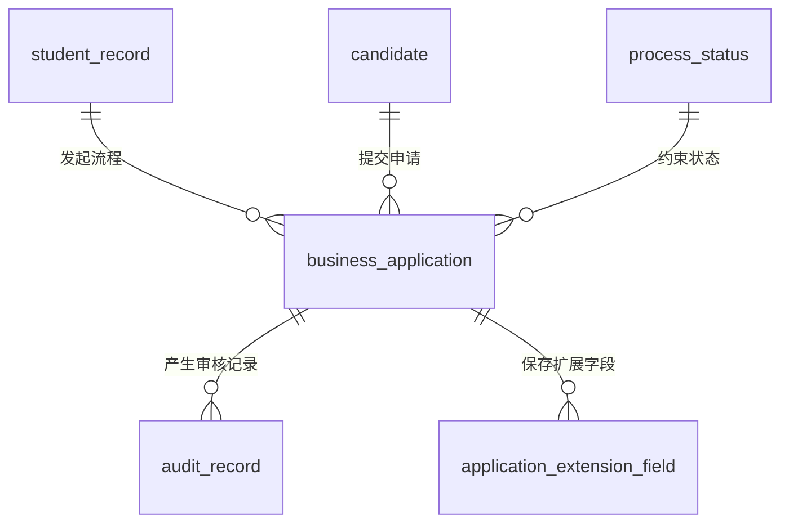

# 业务流程数据库设计

## 一、设计范围

本文档对应《实施计划》第四阶段 4.1 任务，覆盖业务流程基础表设计：

- `business_application`：通用业务申请表。
- `audit_record`：审核记录表。
- `process_status`：流程状态表。
- `application_extension_field`：申请业务扩展字段表。

以上表结构已在 `sql/init.sql` 中实现，可随系统初始化脚本创建。测试数据位于 `sql/test-data.sql`。

## 二、设计原则

- 免考、课程顶替、考籍转入转出和毕业申请共用 `business_application` 保存主流程字段。
- 不同业务的差异字段写入 `application_extension_field`，并同步在 `business_application.extension_data_json` 中保存快照，便于列表查询和详情展示。
- 审核、撤回、驳回、通过等流程动作统一写入 `audit_record`，后续流程记录查询直接基于该表展示时间线。
- 流程状态由 `process_status` 维护，后续审核服务应基于 `next_status_codes` 校验状态流转是否合法。
- 本阶段沿用项目现有逻辑外键方式，业务服务负责校验 `record_id`、`candidate_id` 和 `application_id` 的有效性。

## 三、实体关系

## 四、表结构说明

### 1. 通用业务申请表 business_application

| 字段名 | 类型 | 必填 | 说明 |
| --- | --- | --- | --- |
| id | BIGINT | 是 | 主键，自增。 |
| application_no | VARCHAR(64) | 是 | 申请编号，全表唯一。 |
| business_type | VARCHAR(64) | 是 | 业务类型。 |
| record_id | BIGINT | 是 | 考籍档案 ID。 |
| candidate_id | BIGINT | 是 | 考生 ID。 |
| application_title | VARCHAR(128) | 否 | 申请标题。 |
| application_status | VARCHAR(32) | 是 | 申请状态，默认 `SUBMITTED`。 |
| current_node_code | VARCHAR(64) | 否 | 当前流程节点编码。 |
| current_node_name | VARCHAR(64) | 否 | 当前流程节点名称。 |
| course_code | VARCHAR(64) | 否 | 目标课程代码，免考或课程顶替业务使用。 |
| course_name | VARCHAR(128) | 否 | 目标课程名称，免考或课程顶替业务使用。 |
| source_course_code | VARCHAR(64) | 否 | 来源课程代码，免考或课程顶替业务使用。 |
| source_course_name | VARCHAR(128) | 否 | 来源课程名称，免考或课程顶替业务使用。 |
| exemption_reason | VARCHAR(512) | 否 | 免考原因。 |
| material_ids_json | TEXT | 否 | 申请材料 ID 列表 JSON。 |
| extension_data_json | TEXT | 否 | 业务扩展字段快照 JSON。 |
| apply_user_id | BIGINT | 否 | 提交人 ID。 |
| apply_user_name | VARCHAR(64) | 否 | 提交人姓名。 |
| submit_time | DATETIME | 是 | 提交时间。 |
| withdraw_time | DATETIME | 否 | 撤回时间。 |
| withdraw_reason | VARCHAR(512) | 否 | 撤回原因。 |
| audit_user_id | BIGINT | 否 | 最近审核人 ID。 |
| audit_user_name | VARCHAR(64) | 否 | 最近审核人姓名。 |
| audit_time | DATETIME | 否 | 最近审核时间。 |
| audit_opinion | VARCHAR(512) | 否 | 最近审核意见。 |
| remark | VARCHAR(512) | 否 | 备注。 |
| create_time | DATETIME | 是 | 创建时间。 |
| update_time | DATETIME | 是 | 更新时间。 |

索引设计：

- `uk_business_application_no`：保证申请编号唯一。
- `idx_business_application_type_status`：支持按业务类型和状态筛选审核列表。
- `idx_business_application_record_id`：支持按考籍档案查询流程。
- `idx_business_application_candidate_id`：支持按考生查询申请。
- `idx_business_application_submit_time`：支持按提交时间排序。

### 2. 审核记录表 audit_record

| 字段名 | 类型 | 必填 | 说明 |
| --- | --- | --- | --- |
| id | BIGINT | 是 | 主键，自增。 |
| application_id | BIGINT | 否 | 通用申请 ID。 |
| business_type | VARCHAR(64) | 是 | 业务类型。 |
| business_id | BIGINT | 是 | 业务 ID。通用申请流程中与 `application_id` 一致。 |
| record_id | BIGINT | 否 | 考籍档案 ID。 |
| audit_action | VARCHAR(32) | 是 | 流程动作。 |
| before_status | VARCHAR(32) | 否 | 操作前申请状态。 |
| after_status | VARCHAR(32) | 是 | 操作后申请状态。 |
| audit_status | VARCHAR(32) | 是 | 审核状态。 |
| audit_opinion | VARCHAR(512) | 否 | 审核意见或流程说明。 |
| auditor_id | BIGINT | 否 | 审核人或操作人 ID。 |
| auditor_name | VARCHAR(64) | 否 | 审核人或操作人姓名。 |
| operation_time | DATETIME | 是 | 操作时间。 |
| create_time | DATETIME | 是 | 创建时间。 |

索引设计：

- `idx_audit_record_application_id`：支持按申请查询时间线。
- `idx_audit_record_business`：兼容按业务类型和业务 ID 查询。
- `idx_audit_record_status`：支持按审核状态筛选。
- `idx_audit_record_operation_time`：支持流程时间线排序。

### 3. 流程状态表 process_status

| 字段名 | 类型 | 必填 | 说明 |
| --- | --- | --- | --- |
| id | BIGINT | 是 | 主键，自增。 |
| business_type | VARCHAR(64) | 是 | 业务类型。 |
| status_code | VARCHAR(32) | 是 | 流程状态编码。 |
| status_name | VARCHAR(64) | 是 | 流程状态名称。 |
| status_sort | INT | 是 | 状态排序。 |
| initial_status | TINYINT | 是 | 是否初始状态。 |
| final_status | TINYINT | 是 | 是否终态。 |
| allow_edit | TINYINT | 是 | 当前状态是否允许编辑申请。 |
| allow_withdraw | TINYINT | 是 | 当前状态是否允许撤回申请。 |
| next_status_codes | VARCHAR(255) | 否 | 允许流转的下一状态编码，多个用英文逗号分隔。 |
| description | VARCHAR(512) | 否 | 状态说明。 |
| status | VARCHAR(32) | 是 | 启用状态，默认 `ENABLED`。 |
| create_time | DATETIME | 是 | 创建时间。 |
| update_time | DATETIME | 是 | 更新时间。 |

索引设计：

- `uk_process_status_type_code`：保证同一业务类型下状态编码唯一。
- `idx_process_status_type_sort`：支持按业务类型加载状态顺序。
- `idx_process_status_enabled`：支持筛选启用状态。

### 4. 申请业务扩展字段表 application_extension_field

| 字段名 | 类型 | 必填 | 说明 |
| --- | --- | --- | --- |
| id | BIGINT | 是 | 主键，自增。 |
| application_id | BIGINT | 是 | 通用申请 ID。 |
| business_type | VARCHAR(64) | 是 | 业务类型。 |
| field_code | VARCHAR(64) | 是 | 扩展字段编码。 |
| field_name | VARCHAR(128) | 是 | 扩展字段名称。 |
| field_value | TEXT | 否 | 扩展字段值。 |
| value_type | VARCHAR(32) | 是 | 字段值类型，默认 `STRING`。 |
| required_flag | TINYINT | 是 | 是否必填。 |
| sort_order | INT | 是 | 排序值。 |
| create_time | DATETIME | 是 | 创建时间。 |
| update_time | DATETIME | 是 | 更新时间。 |

索引设计：

- `uk_application_extension_field`：保证同一申请下字段编码唯一。
- `idx_application_extension_application_id`：支持按申请加载扩展字段。
- `idx_application_extension_type_code`：支持按业务类型和字段编码统计或检索。

## 五、状态字典建议

| 字段 | 推荐值 | 说明 |
| --- | --- | --- |
| business_application.business_type | `EXEMPTION`、`COURSE_REPLACE`、`TRANSFER_IN`、`TRANSFER_OUT`、`GRADUATION` | 免考、课程顶替、考籍转入、考籍转出、毕业申请。 |
| business_application.application_status | `DRAFT`、`SUBMITTED`、`AUDITING`、`APPROVED`、`REJECTED`、`WITHDRAWN` | 草稿、已提交、审核中、审核通过、审核驳回、已撤回。 |
| audit_record.audit_action | `SUBMIT`、`APPROVE`、`REJECT`、`WITHDRAW` | 提交、审核通过、审核驳回、撤回。 |
| application_extension_field.value_type | `STRING`、`NUMBER`、`DATE`、`JSON` | 字符串、数值、日期、JSON。 |
| process_status.status | `ENABLED`、`DISABLED` | 启用、禁用。 |

## 六、扩展字段示例

免考申请可写入以下扩展字段：

| 字段编码 | 字段名称 | 是否必填 | 说明 |
| --- | --- | --- | --- |
| courseCode | 免考课程代码 | 是 | 申请免考的课程代码。 |
| courseName | 免考课程名称 | 是 | 申请免考的课程名称。 |
| sourceCourseCode | 证明来源课程代码 | 否 | 用于证明免考资格的来源课程或证书编码。 |
| sourceCourseName | 证明来源课程名称 | 否 | 用于证明免考资格的来源课程或证书名称。 |
| exemptionReason | 免考原因 | 是 | 申请免考的原因说明。 |

考籍转入转出申请可写入以下扩展字段：

| 字段编码 | 字段名称 | 是否必填 | 说明 |
| --- | --- | --- | --- |
| sourceProvince | 原考籍省份 | 转入必填 | 考籍转入时记录原考籍所在地。 |
| sourceSchool | 原考籍单位 | 否 | 考籍转入时记录原考籍管理单位。 |
| sourceRecordNo | 原考籍号 | 否 | 考籍转入时记录原考籍号码。 |
| targetProvince | 目标省份 | 转出必填 | 考籍转出时记录目标接收地。 |
| targetSchool | 目标接收单位 | 否 | 考籍转出时记录目标接收单位。 |
| transferReason | 转考原因 | 是 | 转入或转出的业务原因。 |

后续课程顶替和毕业申请可继续复用该表保存规则 ID、资格校验结果等差异字段。

## 七、后续实现要求

- 提交申请时，先写入 `business_application`，再写入 `application_extension_field` 和 `audit_record`。
- 修改申请时，仅允许在 `process_status.allow_edit = 1` 的状态下执行。
- 撤回申请时，仅允许在 `process_status.allow_withdraw = 1` 的状态下执行，并写入 `audit_record`。
- 审核通过或驳回时，必须校验目标状态是否存在于当前状态的 `next_status_codes`。
- 审核通过后如需联动考籍状态，应同步写入 `record_status_log` 和 `record_change_log`。
- 流程状态流转、审核处理等关键服务方法需要补充严格 Doxygen 注释。
