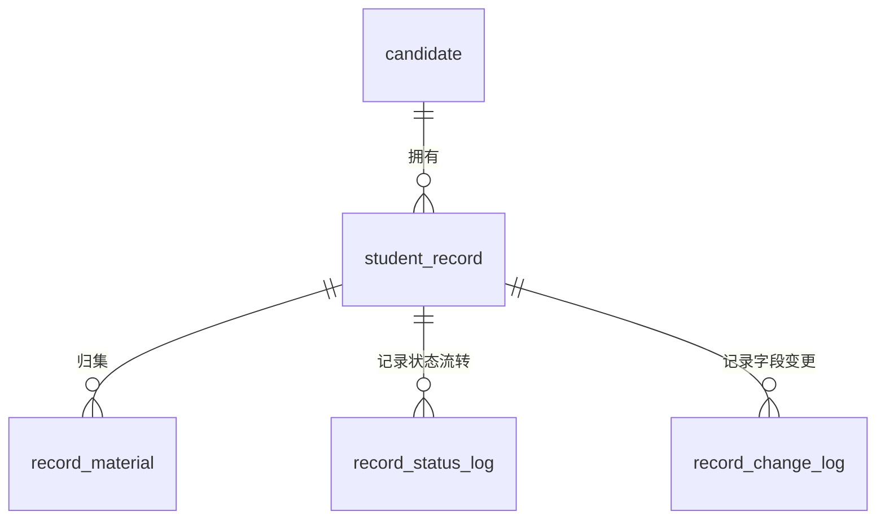

# 考籍核心业务数据库设计

## 一、设计范围

本文档对应《实施计划》第三阶段 3.1 任务，覆盖以下五张核心业务表：

- `candidate`：考生基础信息表。
- `student_record`：考籍档案表。
- `record_material`：档案材料表。
- `record_status_log`：档案状态记录表。
- `record_change_log`：档案变更记录表。

以上表结构已在 `sql/init.sql` 中实现，可随系统初始化脚本创建。

## 二、实体关系

## 三、表结构说明

### 1. 考生基础信息表 candidate

| 字段名 | 类型 | 必填 | 说明 |
| --- | --- | --- | --- |
| id | BIGINT | 是 | 主键，自增。 |
| name | VARCHAR(64) | 是 | 考生姓名。 |
| gender | VARCHAR(16) | 否 | 性别。 |
| id_card | VARCHAR(32) | 是 | 身份证号，全表唯一。 |
| admission_no | VARCHAR(64) | 否 | 准考证号，全表唯一。 |
| birth_date | DATE | 否 | 出生日期。 |
| nation | VARCHAR(32) | 否 | 民族。 |
| political_status | VARCHAR(32) | 否 | 政治面貌。 |
| education_level | VARCHAR(32) | 否 | 学历层次。 |
| major_name | VARCHAR(128) | 否 | 报考专业。 |
| phone | VARCHAR(32) | 否 | 联系电话。 |
| email | VARCHAR(128) | 否 | 电子邮箱。 |
| address | VARCHAR(255) | 否 | 联系地址。 |
| status | VARCHAR(32) | 是 | 考生状态，默认 `NORMAL`。 |
| create_time | DATETIME | 是 | 创建时间。 |
| update_time | DATETIME | 是 | 更新时间。 |

索引设计：

- `uk_candidate_id_card`：保证身份证号唯一。
- `uk_candidate_admission_no`：保证准考证号唯一。
- `idx_candidate_name`：支持按姓名检索。
- `idx_candidate_status`：支持按考生状态筛选。

### 2. 考籍档案表 student_record

| 字段名 | 类型 | 必填 | 说明 |
| --- | --- | --- | --- |
| id | BIGINT | 是 | 主键，自增。 |
| candidate_id | BIGINT | 是 | 考生 ID，关联 `candidate.id`。 |
| record_no | VARCHAR(64) | 是 | 考籍号，全表唯一。 |
| enroll_batch | VARCHAR(64) | 否 | 注册批次。 |
| education_level | VARCHAR(32) | 否 | 考籍层次。 |
| major_code | VARCHAR(64) | 否 | 专业代码。 |
| major_name | VARCHAR(128) | 否 | 专业名称。 |
| record_status | VARCHAR(32) | 是 | 考籍状态，默认 `NORMAL`。 |
| archive_status | VARCHAR(32) | 是 | 归档状态，默认 `UNARCHIVED`。 |
| archive_time | DATETIME | 否 | 归档时间。 |
| archive_operator_id | BIGINT | 否 | 归档操作人 ID。 |
| remark | VARCHAR(512) | 否 | 备注。 |
| create_time | DATETIME | 是 | 创建时间。 |
| update_time | DATETIME | 是 | 更新时间。 |

索引设计：

- `uk_student_record_no`：保证考籍号唯一。
- `idx_student_record_candidate_id`：支持按考生查询考籍档案。
- `idx_student_record_status`：支持按考籍状态筛选。
- `idx_student_record_archive_status`：支持按归档状态筛选。

### 3. 档案材料表 record_material

| 字段名 | 类型 | 必填 | 说明 |
| --- | --- | --- | --- |
| id | BIGINT | 是 | 主键，自增。 |
| record_id | BIGINT | 是 | 考籍档案 ID，关联 `student_record.id`。 |
| material_type | VARCHAR(64) | 是 | 材料类型。 |
| file_name | VARCHAR(255) | 是 | 系统保存文件名。 |
| original_file_name | VARCHAR(255) | 否 | 原始文件名。 |
| file_url | VARCHAR(512) | 是 | 文件访问地址。 |
| file_size | BIGINT | 否 | 文件大小，单位字节。 |
| file_suffix | VARCHAR(32) | 否 | 文件后缀。 |
| mime_type | VARCHAR(128) | 否 | 文件 MIME 类型。 |
| preview_url | VARCHAR(512) | 否 | 预览地址。 |
| upload_user_id | BIGINT | 否 | 上传人 ID。 |
| audit_status | VARCHAR(32) | 是 | 审核状态，默认 `PENDING`。 |
| audit_opinion | VARCHAR(512) | 否 | 审核意见。 |
| audit_user_id | BIGINT | 否 | 审核人 ID。 |
| audit_time | DATETIME | 否 | 审核时间。 |
| create_time | DATETIME | 是 | 创建时间。 |
| update_time | DATETIME | 是 | 更新时间。 |

索引设计：

- `idx_record_material_record_id`：支持按考籍档案查询材料。
- `idx_record_material_type`：支持按材料类型筛选。
- `idx_record_material_audit_status`：支持按审核状态筛选。

### 4. 档案状态记录表 record_status_log

| 字段名 | 类型 | 必填 | 说明 |
| --- | --- | --- | --- |
| id | BIGINT | 是 | 主键，自增。 |
| record_id | BIGINT | 是 | 考籍档案 ID，关联 `student_record.id`。 |
| before_status | VARCHAR(32) | 否 | 变更前状态。 |
| after_status | VARCHAR(32) | 是 | 变更后状态。 |
| change_reason | VARCHAR(512) | 否 | 状态变更原因。 |
| operator_id | BIGINT | 否 | 操作人 ID。 |
| operator_name | VARCHAR(64) | 否 | 操作人姓名。 |
| operation_time | DATETIME | 是 | 操作时间。 |

索引设计：

- `idx_record_status_log_record_id`：支持按考籍档案查询状态流转记录。
- `idx_record_status_log_operation_time`：支持按操作时间排序和筛选。
- `idx_record_status_log_after_status`：支持按变更后状态统计。

### 5. 档案变更记录表 record_change_log

| 字段名 | 类型 | 必填 | 说明 |
| --- | --- | --- | --- |
| id | BIGINT | 是 | 主键，自增。 |
| record_id | BIGINT | 是 | 考籍档案 ID，关联 `student_record.id`。 |
| change_type | VARCHAR(64) | 是 | 变更类型。 |
| change_field | VARCHAR(128) | 否 | 变更字段。 |
| before_value | TEXT | 否 | 变更前内容。 |
| after_value | TEXT | 否 | 变更后内容。 |
| change_reason | VARCHAR(512) | 否 | 变更原因。 |
| operator_id | BIGINT | 否 | 操作人 ID。 |
| operator_name | VARCHAR(64) | 否 | 操作人姓名。 |
| operation_time | DATETIME | 是 | 操作时间。 |

索引设计：

- `idx_record_change_log_record_id`：支持按考籍档案查询变更记录。
- `idx_record_change_log_change_type`：支持按变更类型筛选。
- `idx_record_change_log_operation_time`：支持按操作时间排序和筛选。

## 四、状态字典建议

| 字段 | 推荐值 | 说明 |
| --- | --- | --- |
| candidate.status | `NORMAL`、`LOCKED`、`DISABLED` | 正常、锁定、停用。 |
| student_record.record_status | `NORMAL`、`SUSPENDED`、`TRANSFERRED_OUT`、`GRADUATED` | 正常、暂缓、已转出、已毕业。 |
| student_record.archive_status | `UNARCHIVED`、`ARCHIVED` | 未归档、已归档。 |
| record_material.audit_status | `PENDING`、`APPROVED`、`REJECTED` | 待审核、审核通过、审核驳回。 |
| record_change_log.change_type | `CREATE`、`UPDATE`、`ARCHIVE`、`STATUS_CHANGE`、`MATERIAL_CHANGE` | 创建、更新、归档、状态变更、材料变更。 |

## 五、实现说明

- 本阶段优先采用逻辑外键关系，避免初始化演示数据时因导入顺序影响脚本重复执行。
- 业务服务在后续任务中需要校验 `candidate_id`、`record_id` 等关联 ID 的有效性。
- 状态流转、归档、材料审核和变更记录生成属于后续 3.2 至 3.5 的业务接口职责。
